# SOAP Test System - Flow Chart Documentation

## 1. System Overview

This SOAP test system demonstrates a complete SOAP 1.1 web service implementation with two components:

- **SOAP Server (Go)**: HTTP server on port 8080 implementing three SOAP operations
- **SOAP Client (Spring Boot)**: REST API on port 8081 that bridges REST requests to SOAP calls

### Technology Stack

| Component | Technology | Purpose |
|-----------|------------|---------|
| Server | Go 1.21 | SOAP endpoint implementation |
| Client | Spring Boot 3.2.2 | REST-to-SOAP gateway |
| SOAP Version | SOAP 1.1 | Message protocol |
| MTOM | SAAJ + JAXB | Binary optimization |
| Documentation | SpringDoc OpenAPI | Swagger UI |

### SOAP Operations

| Operation | SOAPAction | Description |
|-----------|------------|-------------|
| GetUser | `http://example.com/soap/user/GetUser` | Retrieve user by ID |
| UploadFile | `http://example.com/soap/user/UploadFile` | Upload file (Base64) |
| UploadFileMTOM | `http://example.com/soap/user/UploadFileMTOM` | Upload file (MTOM) |

### REST Endpoints

| Method | Path | SOAP Operation |
|--------|------|----------------|
| GET | `/api/user/{id}` | GetUser |
| POST | `/api/upload` | UploadFile (Base64) |
| POST | `/api/upload-mtom` | UploadFileMTOM |
| GET | `/api/health` | Health check |
| GET | `/wsdl` | WSDL download |

---

## 2. High-Level Architecture

```mermaid
graph TB
    subgraph Client["Client Side - Port 8081 (Spring Boot)"]
        REST[REST Client<br/>cURL/Swagger]
        TC[TestController<br/>@RestController]
        SC[SoapConfig<br/>Standard SOAP]
        SMC[SoapMtomConfig<br/>MTOM Enabled]
        USC[UserSoapClient<br/>Base64]
        USMC[UserSoapMtomClient<br/>MTOM]
        WST[WebServiceTemplate<br/>Spring WS]

        REST -->|"GET /api/user/1"| TC
        REST -->|"POST /api/upload"| TC
        REST -->|"POST /api/upload-mtom"| TC

        TC -->|"getUser"| USC
        TC -->|"uploadFile"| USC
        TC -->|"uploadFileMTOM"| USMC

        SC -->|"Creates"| USC
        SMC -->|"Creates"| USMC

        USC -->|"marshalSendAndReceive"| WST
        USMC -->|"marshalSendAndReceive"| WST
    end

    subgraph Server["Server Side - Port 8080 (Go)"]
        MUX[HTTP ServeMux<br/>/soap Router]
        H[Health Handler<br/>/health]
        WSDL[WSDL Handler<br/>/wsdl]
        GU[GetUser Handler<br/>user.go]
        UF[UploadFile Handler<br/>file.go<br/>Base64]
        UFM[UploadFileMTOM Handler<br/>file_mtom.go<br/>MIME Parsing]
        DB[(Mock User DB<br/>map[string]User)]
        FS[(File System<br/>./uploads)]

        MUX -->|"SOAPAction"| GU
        MUX -->|"SOAPAction"| UF
        MUX -->|"SOAPAction"| UFM
        MUX --> H
        MUX --> WSDL

        GU --> DB
        UF --> FS
        UFM --> FS
    end

    WST ==>|"SOAP/HTTP<br/>text/xml"| MUX
    WST ==>|"SOAP/HTTP<br/>multipart/related"| MUX

    style REST fill:#e1f5fe
    style TC fill:#fff9c4
    style WST fill:#c8e6c9
    style MUX fill:#ffccbc
    style DB fill:#d1c4e9
    style FS fill:#d1c4e9
```

### Architecture Notes

- **Dual Client Strategy**: Separate client beans for Base64 (`UserSoapClient`) and MTOM (`UserSoapMtomClient`) operations
- **SOAPAction Routing**: Server uses SOAPAction header as primary routing mechanism
- **Fallback Routing**: Server parses request body when SOAPAction is missing
- **MTOM Detection**: Server detects MTOM requests via `Content-Type: multipart/related`

---

## 3. Sequence Diagrams

### 3.1 GetUser Operation Flow

```mermaid
sequenceDiagram
    autonumber
    participant RC as REST Client<br/>(cURL/Swagger)
    participant TC as TestController
    participant USC as UserSoapClient
    participant WST as WebServiceTemplate
    participant SVR as SOAP Server<br/>(Go main.go)
    participant GU as GetUser Handler
    participant DB as Mock User DB

    RC->>TC: GET /api/user/1
    TC->>TC: log.info("REST Request")
    TC->>USC: getUser("1")

    USC->>USC: Create GetUserRequest("1")
    USC->>WST: marshalSendAndReceive(request)<br/>+ SoapActionCallback

    Note over WST: JAXB marshals to XML
    WST->>SVR: POST /soap<br/>SOAPAction: GetUser<br/>Content-Type: text/xml

    SVR->>SVR: Read SOAPAction header
    SVR->>GU: Route to GetUser handler

    GU->>GU: XML Decode SOAP Envelope
    GU->>GU: Extract ID from Body

    GU->>DB: userDB["1"]
    DB-->>GU: User{id:"1", name:"홍길동"}

    GU->>GU: Build SOAP Response
    GU-->>SVR: SOAP XML Response

    SVR-->>WST: HTTP 200<br/>Content-Type: text/xml

    Note over WST: JAXB unmarshals XML
    WST-->>USC: GetUserResponse

    USC-->>TC: GetUserResponse
    TC->>TC: Build Map result
    TC-->>RC: HTTP 200 JSON<br/>{"id":"1","name":"홍길동",...}
```



### 3.2 UploadFile (Base64) Operation Flow


### 3.3 UploadFileMTOM Operation Flow


---

## 4. SOAP Message Processing Flowchart


### Key Processing Points

1. **SOAPAction Priority**: Server checks SOAPAction header first (primary routing)
2. **Content-Based Fallback**: Parses request body for operation name when SOAPAction is missing
3. **MTOM Detection**: Checks `Content-Type: multipart/related` to detect MTOM
4. **XOP Resolution**: Matches `href="cid:..."` to MIME part `Content-ID`

---

## 5. Spring Component Interaction

```mermaid
graph TB
    subgraph SpringContext["Spring ApplicationContext"]
        subgraph Config["@Configuration Classes"]
            SC[SoapConfig]
            SMC[SoapMtomConfig]
            OAC[OpenApiConfig]
        end

        subgraph Beans["@Beans Created"]
            JM[Jaxb2Marshaller<br/>Standard]
            JMM[Jaxb2Marshaller<br/>mtomEnabled=true]
            SMF[SaajSoapMessageFactory<br/>SOAP 1.1]
            WST[WebServiceTemplate<br/>Standard]
            MWST[WebServiceTemplate<br/>MTOM]
            USC[UserSoapClient]
            USMC[UserSoapMtomClient]
        end

        subgraph Controllers["@RestController"]
            TC[TestController<br/>@Autowired clients]
        end

        subgraph Models["JAXB Models"]
            GUR[GetUserRequest/Response]
            UFR[UploadFileRequest/Response]
            UFMR[UploadFileMTOMRequest/Response]
        end

        SC -->|"Creates"| JM
        SC -->|"Creates"| SMF
        SC -->|"Creates"| WST
        SC -->|"Creates"| USC

        SMC -->|"Creates"| JMM
        SMC -->|"Creates"| MWST
        SMC -->|"Creates"| USMC

        OAC -.->|"Configures"| TC

        TC -->|"Injects"| USC
        TC -->|"Injects"| USMC

        USC -->|"Uses"| WST
        USMC -->|"Uses"| MWST

        WST -->|"Uses"| JM
        WST -->|"Uses"| SMF

        MWST -->|"Uses"| JMM
        MWST -->|"Uses"| SMF

        JM -.->|"Marshals/Unmarshals"| GUR
        JM -.->|"Marshals/Unmarshals"| UFR

        JMM -.->|"Marshals/Unmarshals"| UFMR
    end

    style SC fill:#e3f2fd
    style SMC fill:#f3e5f5
    style TC fill:#fff9c4
    style WST fill:#c8e6c9
    style MWST fill:#c8e6c9
```

### Dependency Injection Flow

1. **Configuration Classes**: `@Configuration` classes define bean creation methods
2. **Marshaller Beans**: Separate marshallers for standard and MTOM operations
3. **Template Beans**: `WebServiceTemplate` beans use appropriate marshaller/message factory
4. **Client Beans**: Client classes receive template via constructor injection
5. **Controller Injection**: `TestController` receives both clients via `@Autowired`

---

## 6. Data Flow Comparison: Base64 vs MTOM


### Size Comparison Table

| Stage | Base64 | MTOM | Savings |
|-------|--------|------|---------|
| Original File | 1 MB | 1 MB | - |
| Encoding | +33% | +1% | ~32% |
| Transfer Size | ~1.33 MB | ~1.01 MB | ~320 KB |
| Decode | Required | Not needed | CPU savings |
| Memory | Higher (copy) | Lower (stream) | - |

---

## 7. MTOM vs Base64 Technical Comparison

```mermaid
graph LR
    subgraph Base64["Base64 Encoding"]
        B1[Binary Data]
        B2[Base64 Encode<br/>A-Za-z0-9+/ characters]
        B3[Embed in XML<br/><fileData>SGVsbG8...8K</fileData>]
        B4[Transfer as text/xml]
        B5[Base64 Decode]
        B6[Binary Data]
    end

    subgraph MTOM["MTOM Encoding"]
        M1[Binary Data]
        M2[Create XOP Reference<br/><fileData><xop:Include<br/>href="cid:uuid"/></fileData>]
        M3[MIME Multipart<br/>Part 1: XML with XOP<br/>Part 2: Binary attachment<br/>Content-ID: uuid]
        M4[Transfer as multipart/related]
        M5[Extract by Content-ID<br/>No decoding needed]
        M6[Binary Data]
    end

    style B3 fill:#ffcdd2
    style M3 fill:#c8e6c9
    style B5 fill:#ffecb3
    style M5 fill:#c8e6c9
```

### Technical Differences

| Aspect | Base64 | MTOM |
|--------|--------|------|
| **Content-Type** | `text/xml` | `multipart/related; boundary=...` |
| **Data Format** | Text in XML body | Binary MIME attachment |
| **XML Structure** | `<fileData>base64string</fileData>` | `<fileData><xop:Include href="cid:.."/></fileData>` |
| **Encoding** | 64-character alphabet | Raw binary (8-bit) |
| **Size Overhead** | ~33% | ~1% (MIME headers only) |
| **Processing** | Encode/Decode required | Direct byte copy |
| **CPU Usage** | Higher | Lower |
| **Memory** | Requires full copy | Can stream |
| **Standards** | XML Schema | MTOM 1.0 + XOP |

---

## 8. Error Handling Flowchart


### SOAP Fault Structure

```xml
<soap:Fault>
    <faultcode>Client | Server</faultcode>
    <faultstring>Human-readable error message</faultstring>
    <detail>Detailed error information</detail>
</soap:Fault>
```

### Error Classification

| Category | Fault Code | Examples |
|----------|------------|----------|
| **Client** | `Client` | Invalid XML, missing fields, bad base64, user not found |
| **Server** | `Server` | I/O errors, directory creation failures, file write errors |

---

## 9. Complete End-to-End Request Flow


---

## 10. Legend and Symbols

### Diagram Conventions

| Symbol | Meaning |
|--------|---------|
| `→` | Synchronous call |
| `-->` | Response/Return |
| `==>` | HTTP/SOAP over network |
| `-.->` | Configuration reference |
| `[...]` | Storage/Database |
| `(...)` | Grouped component |

### Color Coding

| Color | Usage |
|-------|-------|
| 🟢 Green | Success/Healthy/Client |
| 🔴 Red | Error/Failure |
| 🟡 Yellow | Processing/Warning |
| 🟣 Purple | MTOM/MIME processing |
| 🔵 Blue | Configuration/Setup |

---

## Appendix: Key Code References

### Server Routing Logic (`server/main.go`)

```go
// Line 26-49: SOAPAction-based routing
soapAction := r.Header.Get("SOAPAction")
soapAction = stripQuotes(soapAction)
switch soapAction {
case "http://example.com/soap/user/GetUser":
    handler.GetUser(w, r)
case "http://example.com/soap/user/UploadFile":
    handler.UploadFile(uploadDir)(w, r)
case "http://example.com/soap/user/UploadFileMTOM":
    handler.UploadFileMTOM(uploadDir)(w, r)
}
```

### MTOM XOP Resolution (`server/handler/file_mtom.go`)

```go
// Line 248-256: Extract Content-ID from XOP Include
re := regexp.MustCompile(`href=["']cid:([^"']+)["']`)
matches := re.FindStringSubmatch(fileDataElement)
if len(matches) > 1 {
    xopRefs = append(xopRefs, matches[1])
}

// Line 202-214: Resolve XOP to binary data
for _, xopRef := range xopRefs {
    for _, part := range parts {
        if part.ContentID == xopRef {
            fileData = part.Data
            break
        }
    }
}
```

### Spring MTOM Configuration (`client/.../SoapMtomConfig.java`)

```java
// Line 36-42: Enable MTOM on marshaller
@Bean
public Jaxb2Marshaller mtomMarshaller() {
    Jaxb2Marshaller marshaller = new Jaxb2Marshaller();
    marshaller.setPackagesToScan("com.example.soap.model");
    marshaller.setMtomEnabled(true);  // ← Enables MTOM
    marshaller.setSupportDtd(false);  // Security
    return marshaller;
}
```

---

## Version History

| Version | Date | Changes |
|---------|------|---------|
| 1.0.0 | 2024-02-01 | Initial documentation with all flow charts |

---

*This documentation was generated as part of the SOAP Test System project. For the latest source code, refer to the project repository.*
